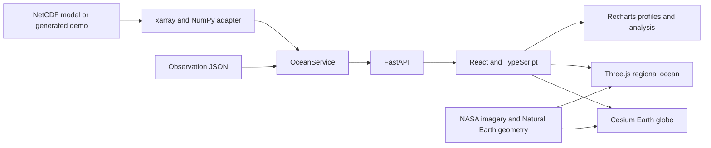

# OceanTwin3D

OceanTwin3D is an interactive 4D ocean data exploration prototype for SIH26067. It connects location, depth, time, model fields, and instrument profiles in one scientific workspace.

The application starts on a Cesium Earth globe. Selecting an observation opens a regional Three.js ocean view with depth slices, currents, profiles, transects, and region statistics. A FastAPI backend reads NetCDF data through xarray and NumPy and serves the built React application.

> **Important:** The bundled model and instrument profiles are deterministic synthetic demonstration data. They are not live INCOIS data, an operational forecast, or independent validation of model skill.

Repository: https://github.com/manaour2006/OceanTwin3D

## Features

### Global globe

- Cesium Earth globe with locally bundled NASA Blue Marble imagery.
- Independent controls for the geographic basemap and scientific ocean overlay.
- Basin camera presets, orbit, zoom, geographic picking, and observation markers.
- Locally prepared Natural Earth land geometry for geographic context.

### Regional ocean view

- Top-down and angled 3D views around a selected observation.
- Temperature, salinity, chlorophyll, and derived current speed.
- Continuous depth selection interpolated between source levels.
- Time playback, frame navigation, timeline scrubbing, and loading-state preservation.
- Current vectors, streamlines, and illustrative animated particles.
- Depth-colored sections and a sampled 3D volume view.
- Responsive camera fitting for the available viewport.

### Observations and analysis

- Synthetic Argo and glider markers with selectable profiles.
- Model sampling at instrument coordinates and observed depths.
- Calculated RMSE, MAE, bias, matched levels, and timestamp offset.
- Profile probe for all variables through the water column.
- Fixed-depth great-circle transects between two coordinates.
- Region statistics: mean, minimum, maximum, median, and population standard deviation.
- Regional cutouts containing fields, currents, coastlines, and nearby observations.

The regional vertical view is a visualization aid. Its depth scale is deliberately exaggerated and labelled; it is not a literal bathymetric reconstruction.

## Demo data

The default dataset is generated by `backend/scripts/generate_demo_data.py` and stored in `backend/data/`.

| Property | Value |
| --- | --- |
| Longitude | 144 global coordinates, -180 to 177.5 degrees, 2.5 degree spacing |
| Latitude | 62 coordinates, -75 to 75 degrees |
| Depth | 0, 10, 25, 50, 100, 200, 500, 1000, and 2000 metres |
| Time | 13 weekly frames from 1 January to 26 March 2026 |
| Observations | 17 synthetic Argo profiles and 5 synthetic glider profiles |
| Variables | Temperature, salinity, chlorophyll, u-current, and v-current |

The generator creates analytic ocean-like gradients, thermoclines, currents, biological patterns, a land mask, and deterministic profile perturbations. It does not download data.

Regenerate it with:

```powershell
.\.venv\Scripts\python.exe -m backend.scripts.generate_demo_data
```

## Quick start

### Requirements

- Python 3.12 or newer; Python 3.13 is tested.
- Node.js 22 LTS and npm.
- A WebGL-capable browser with hardware acceleration.
- Internet access during installation only.

### Windows setup

From the repository root:

```powershell
python setup_project.py
.\.venv\Scripts\python.exe run.py
```

The setup script creates `.venv`, installs locked Python dependencies, runs `npm ci`, prepares local Cesium assets, and builds the production viewer.

Open the application at http://127.0.0.1:8000/.

Useful pages:

- Optional introduction: http://127.0.0.1:8000/?intro
- API documentation: http://127.0.0.1:8000/docs

Manual setup:

```powershell
python -m venv .venv
.\.venv\Scripts\python.exe -m pip install -r backend/requirements.lock.txt
Push-Location frontend
npm ci
npm run build
Pop-Location
.\.venv\Scripts\python.exe run.py
```

On macOS or Linux, use `.venv/bin/python` instead of the Windows interpreter path.

## Development

Run the backend from the repository root:

```powershell
.\.venv\Scripts\python.exe -m uvicorn backend.app.main:app --host 127.0.0.1 --port 8000 --reload
```

In a second terminal, run Vite:

```powershell
Push-Location frontend
npm run dev
Pop-Location
```

Open http://127.0.0.1:5173. Vite proxies `/api` requests to FastAPI. Restart the backend after backend or bundled-data changes. Run a production build before testing the single-process `run.py` entry point after frontend changes.

## Verification

```powershell
.\.venv\Scripts\python.exe -m pytest -q
Push-Location frontend
npm test
npm run format:check
npm run build
Pop-Location
```

Backend tests cover dataset dimensions, interpolation, temporal changes, currents, API validation, uploads, periodic coordinates, dateline transects, profiles, comparisons, and regional statistics. Frontend tests cover nonuniform-grid interpolation, longitude normalization, periodic seams, and missing cells.

## Architecture



Backend ownership:

- `backend/app/adapters/netcdf.py`: coordinate, alias, unit, missing-value, and grid normalization.
- `backend/app/services/ocean.py`: model access, interpolation, profiles, comparisons, and bounded responses.
- `backend/app/services/region.py`: regional cutouts and geographic context.
- `backend/app/main.py`: REST API and production frontend serving.
- `backend/app/models.py`: observation schemas.

Frontend ownership:

- `frontend/src/explorer/GlobeExplorer.tsx`: global Cesium experience.
- `frontend/src/cesium/`: globe layers, camera, sampling, and observations.
- `frontend/src/ocean/`: regional Three.js scene, fields, particles, and coordinates.
- `frontend/src/components/SpatialAnalysis.tsx`: probe, transect, and statistics workflows.
- `frontend/src/App.tsx`: shared state, controls, timeline, uploads, and comparison panels.
- `frontend/src/services/api.ts`: API calls and response contracts.
- `frontend/scripts/prepare-cesium.mjs`: local Cesium engine and asset preparation.

## API

The complete contract is available at `/docs` while the server is running.

| Endpoint | Purpose |
| --- | --- |
| `GET /api/health` | Service and dataset readiness |
| `GET /api/datasets` | Active dataset metadata |
| `GET /api/variables`, `/api/times`, `/api/depths` | Model dimensions and variables |
| `GET /api/ocean/slice` | Variable at one depth and time |
| `GET /api/ocean/volume` | Bounded depth-resolved field |
| `GET /api/currents` | u/v current field |
| `GET /api/ocean/inspect` | Interpolated values at one coordinate |
| `GET /api/ocean/profile` | Full vertical profile |
| `GET /api/ocean/region` | Regional field, currents, coastlines, and observations |
| `GET /api/ocean/transect` | Fixed-depth great-circle transect |
| `GET /api/ocean/stats` | Finite-cell regional statistics |
| `GET /api/observations`, `/api/observations/{id}` | Observation summaries and profiles |
| `GET /api/compare/{id}` | Model-observation comparison metrics |
| `POST /api/datasets/upload` | Validate and load a NetCDF upload |
| `POST /api/datasets/demo` | Restore the bundled demo dataset |

## Scientific assumptions and limitations

- Comparison error is `model - observation`; only finite matched pairs contribute.
- MAE, RMSE, and bias are calculated from the selected values, not static labels.
- Time selection uses model frames and does not invent temporal interpolation.
- Horizontal interpolation uses coordinate spacing and preserves missing coastal cells.
- Global longitude interpolation is periodic, including short paths across the date line.
- Region statistics are equally weighted grid-cell statistics, not area-weighted averages.
- Transects are fixed-depth sections, not full vertical cross-sections.
- The bundled model has no data beyond 75 degrees north or south.
- The isosurface display is a threshold-band preview, not marching cubes.
- Current particles are accelerated for readability, not a real-time forecast.
- The NASA basemap is static geographic context, not an observation layer.

## Loading another NetCDF dataset

Use **Settings -> Load NetCDF dataset**, or configure the server:

```powershell
$env:OCEANTWIN_DATASET = 'C:\ocean-data\model.nc'
$env:OCEANTWIN_OBSERVATIONS = 'C:\ocean-data\observations.json'
.\.venv\Scripts\python.exe run.py
```

The server does not automatically load `.env`; `.env.example` documents supported names.

Compatible files use rectilinear one-dimensional latitude, longitude, depth, and standard-calendar time coordinates. Common aliases include `lat`/`lon`, `thetao`, `so`, `chl`, `uo`, and `vo`. Temperature may be Celsius or Kelvin; currents may be metres per second or centimetres per second. Depth must be metres, not pressure or sigma coordinates.

Curvilinear grids, duplicate coordinates, unsupported calendars, dateline-split regional grids, and unsupported units require preprocessing. Uploads are limited to 64 MiB compressed and a 256 MiB estimated decoded-data budget. Failed uploads leave the active dataset unchanged; uploaded datasets are session-only.

## Project layout

```text
backend/                 FastAPI app, adapters, services, data, and tests
frontend/src/             React, Cesium, Three.js, charts, and UI
frontend/public/          Local imagery, geography, and generated assets
frontend/scripts/         Frontend tests and Cesium preparation
data_sources/             Offline Natural Earth source and attribution
docs/                     Demo, validation, and presentation documentation
run.py                    Single-process API and production viewer entry point
setup_project.py          Reproducible local setup script
```

## Additional documentation

- [docs/DEMO.md](docs/DEMO.md): five-minute walkthrough and recovery steps.
- [docs/SIH_PRESENTATION_GUIDE.md](docs/SIH_PRESENTATION_GUIDE.md): feature inventory, technical talking points, and judge Q&A.
- [docs/VALIDATION.md](docs/VALIDATION.md): automated and browser verification record.
- [frontend/public/earth-imagery.md](frontend/public/earth-imagery.md): NASA Blue Marble attribution.

## Scope and future work

This repository demonstrates a complete local exploration workflow. Production use would require validated operational datasets, data-quality controls, authentication, deployment, real-time ingestion, forecast provenance, performance testing, and domain review. Those capabilities are not claimed by the bundled synthetic demo.