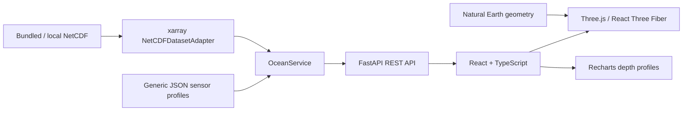

# OceanTwin

**Interactive 4D Digital Twin of the Ocean**

SIH26067 · Ministry of Earth Sciences / INCOIS · Smart India Hackathon prototype

A local scientific workspace for exploring latitude, longitude, depth and time together. Rotate an Indian Ocean water column, descend through a temperature field, follow model currents, and compare an instrument profile with the numerical model.

**The bundled model and all 11 instrument profiles are synthetic.** No live INCOIS connection, operational forecast, or measured validation result is claimed. Natural Earth provides the real coastline geometry.

## Open in PyCharm

Open **this repository folder**, not just `backend`. The repository includes the generated model, source code, tests, and setup scripts. Virtual environments, installed dependencies, local uploads, and compiled frontend assets are excluded from Git.

On a fresh clone, first run `python setup_project.py` from the repository root to create the virtual environment, install dependencies, and build the viewer. Then:

1. In PyCharm, select the existing interpreter **`.venv/Scripts/python.exe`** (Windows). On macOS/Linux use `.venv/bin/python` after setup.
2. Open `run.py` and choose **Run**. Alternatively select the included **OceanTwin · API + built viewer** configuration under `.run/`.
3. Open **[http://127.0.0.1:8000](http://127.0.0.1:8000)**.

One Python process serves both the API and the production frontend. PyCharm's JavaScript tooling is optional; the viewer runs in a browser. The shared Windows run configuration specifies the project interpreter explicitly; on other systems, run `run.py` directly with the configured interpreter.

### Fresh clone / another computer

Prerequisites: **Python 3.12+ (tested with 3.13)**, **Node.js 22 LTS**, npm, and a WebGL-capable browser with hardware acceleration. Installation requires internet access; normal demo operation does not.

Clone the project and run setup:

```powershell
git clone https://github.com/sidhesh0706/OceanTwin3D.git
cd OceanTwin3D
python setup_project.py
.\.venv\Scripts\python.exe run.py
```

The setup script creates `.venv`, installs the pinned Python dependencies, runs `npm ci`, and builds the viewer. Then select that interpreter in PyCharm. On macOS/Linux, launch with `.venv/bin/python run.py`.

Manual equivalent on Windows:

```powershell
python -m venv .venv
.\.venv\Scripts\python.exe -m pip install -r backend/requirements.lock.txt
cd frontend
npm ci
npm run build
cd ..
.\.venv\Scripts\python.exe run.py
```

### Development with hot reload

Run these in separate PyCharm terminal tabs, from the repository root:

```powershell
.\.venv\Scripts\python.exe -m uvicorn backend.app.main:app --host 127.0.0.1 --port 8000 --reload
```

```powershell
cd frontend
npm run dev
```

Open **[http://127.0.0.1:5173](http://127.0.0.1:5173)**. Vite proxies `/api` to FastAPI. After frontend edits, rerun `npm run build` to refresh the viewer served by `run.py`. Restart `run.py` if the build directory was created after the server started.

## Problem and solution

Ocean models generate multidimensional fields, while profile observations describe a sparse measurement network. Disconnected maps and profile plots make it difficult to understand subsurface structure and evaluate a model in its geographic context.

OceanTwin places model fields and instrument profiles in one scene. It demonstrates the integration and exploration workflow relevant to SIH26067 without requiring a database, authentication service, cloud account, or external data API.

## Implemented features

- Perspective WebGL viewer with orbit, pan, zoom, reset, and smoothly animated regional/surface/underwater camera presets.
- Real Natural Earth land geometry and land-masked model cells for the Indian Ocean, Arabian Sea, and Bay of Bengal.
- Temperature, salinity, chlorophyll, and derived current speed; variable-specific palettes, visible units, editable minimum/maximum, and opacity.
- Continuous selected depth, interpolated between model levels. The colored plane visibly descends. A depth ruler, reference grid, and translucent southern model section provide depth cues.
- Full depth-resolved volume point cloud with all nine demo levels. Points are GPU buffers, not individual React components.
- Bilinearly sampled u/v current streaks, advected through the selected depth field. Missing and land cells respawn particles. Three particle-density settings.
- Thirteen timesteps, previous/next, scrubbing, play/pause, and UTC timestamps. Old frames remain labeled during loading; stale responses are cancelled.
- Eight Argo and three glider markers with distinct shapes, sensor list selection, position, profile date, maximum depth, and a selected vertical guide.
- Downward-increasing temperature/salinity/chlorophyll depth charts with observed and model curves; real calculated RMSE, MAE, and bias.
- Slice click inspection with latitude, longitude, depth, and interpolated variables.
- Presentation mode (`P`) with essential controls; `Space` plays/pauses when the page is focused; `Esc` exits the tour/help/presentation.
- Five-step demo tour ending in model comparison. It runs only with the demo dataset.
- Clearly labeled **isosurface preview**, selecting grid points within a tolerance of a threshold. This is not a marching-cubes surface.
- Validated `.nc` upload, restore-demo action, configurable file ingestion, API documentation, and friendly service/renderer error states.
- Optional, feature-detected read-only WebMCP tool `read_ocean_view`, sharing the currently displayed state with supported browser agents.

## Architecture



**Frontend:** React 19, TypeScript, Vite, Three.js, React Three Fiber, Drei, Recharts, Lucide, and custom CSS. Custom CSS keeps this canvas-led interface compact without a dashboard component framework. No remotely loaded fonts or imagery are needed.

**Backend:** Python, FastAPI, xarray, NumPy, pandas, SciPy, netCDF4, Shapely, Pydantic. Python and npm lockfiles capture the installed dependency sets.

## Data pipeline and demo model

`backend/scripts/generate_demo_data.py` reproducibly writes `backend/data/demo_ocean.nc`, `backend/data/observations.json`, and the clipped frontend geography from the bundled Natural Earth source. It does not download anything.

```powershell
.\.venv\Scripts\python.exe -m backend.scripts.generate_demo_data
```

| Dimension | Demo extent |
| --- | --- |
| Longitude | 45–100° E, 73 coordinates |
| Latitude | 12° S–28° N, 57 coordinates |
| Depth | 0, 10, 25, 50, 100, 200, 500, 1000, 2000 m |
| Time | 2 Sep 2026 00:00 to 5 Sep 2026 00:00 UTC, 13 six-hour steps |
| Observations | 8 Argo + 3 gliders, recorded at 3 Sep 2026 00:00 UTC |

Analytic fields include warm surface water, a strong thermocline, cooler deep water, horizontal gradients, an evolving eddy, productive patches, a subsurface chlorophyll maximum, and depth-decaying u/v currents. Sensor values are spatially interpolated from the model and perturbed with deterministic depth-dependent offsets. Comparison errors therefore are **demonstration residuals**, not independent assessments of forecast skill.

The adapter detects and normalizes coordinates and variables, validates units, sorts axes, handles missing cells, and bounds decoded memory. Slices are capped at 73 × 73 coordinates; volume responses at 57 × 57 × 32 levels; current grids at 37 × 37. Endpoints retain domain endpoints when downsampling. Gzip, a bounded field cache, client volume caching, request cancellation, and GPU buffers keep the prototype practical on a laptop.

## How comparison works

For every observed depth, the backend linearly interpolates the selected variable in latitude, longitude, and depth. It does not extrapolate outside the model domain or fill through coastal missing values. Only finite observed/model pairs contribute to the metrics.

For residual `e = model − observed`:

```text
MAE  = mean(abs(e))
RMSE = sqrt(mean(e²))
Bias = mean(e)
```

The UI compares with the currently displayed model timestep and explicitly reports its offset from the fixed observation timestamp. The API chooses the nearest observation-time model step when `time` is omitted. Time is not interpolated. There is no invented match percentage or AI-confidence score.

## Replace the demo with real NetCDF

Use **Load NetCDF dataset** in the explorer, or set a local file in your PyCharm run configuration:

```powershell
$env:OCEANTWIN_DATASET = 'C:\ocean-data\regional-model.nc'
$env:OCEANTWIN_OBSERVATIONS = 'C:\ocean-data\observations.json'
.\.venv\Scripts\python.exe run.py
```

`.env.example` documents these names; `run.py` does not implicitly load `.env`.

The adapter supports regional **rectilinear** data with one-dimensional coordinates on their own dimensions:

| Canonical name | Accepted alternatives |
| --- | --- |
| latitude | lat |
| longitude | lon; 0–360 values normalized to −180–180 |
| depth | lev, level, deptht; metres, positive down or declared positive up |
| time | ocean_time; decoded standard-calendar dates |
| temperature | thetao, temp, water_temp; Celsius or Kelvin |
| salinity | so, salt; practical salinity-compatible units |
| chlorophyll | chl, chla; mg/m³ |
| u_current, v_current | uo/vo, u/v; m/s or cm/s |

Each recognized variable must have all four dimensions. Temperature-only models are accepted; current controls are disabled when u/v are absent. Unsupported calendars, dimensions, units, duplicate coordinates, curvilinear grids, pressure/sigma levels, and global/dateline-crossing regions fail with an explanatory error. Subset or convert such files before ingestion. No real INCOIS file has yet been validated with this prototype.

Uploads are limited to **64 MiB compressed**, with a **256 MiB decoded-data budget**. A candidate is completely validated before replacing the active model. Failed uploads preserve the current model. Uploaded datasets are held for the running session; restart restores the configured/default file. Temporary upload files are removed after loading. Browser uploads intentionally attach no demo sensors to another dataset. Configure real sensor JSON using the environment variable for model comparison.

Observation JSON is a list of generic sources:

```json
[
  {
    "id": "ARGO-EXAMPLE",
    "instrument_type": "ARGO",
    "latitude": 12.4,
    "longitude": 65.5,
    "timestamp": "2026-09-03T00:00:00Z",
    "synthetic": false,
    "profiles": [
      {"depth": 0, "temperature": 28.9, "salinity": 35.2},
      {"depth": 100, "temperature": 20.4, "salinity": 35.1}
    ]
  }
]
```

The schema also accepts `GLIDER`, `CTD`, `MOORING`, and `ADCP`; only Argo and glider visual treatment is polished. Values must use the canonical units above. Historical multi-profile trajectories, QC flags, and live sensor connectors are future work.

## API

Interactive API documentation: **[http://127.0.0.1:8000/docs](http://127.0.0.1:8000/docs)**.

| Endpoint | Purpose |
| --- | --- |
| `GET /api/health` | Service and model load state |
| `GET /api/datasets`, `/api/variables`, `/api/times`, `/api/depths` | Active model metadata |
| `GET /api/ocean/slice?variable=temperature&depth=500&time=0` | Interpolated depth slice |
| `GET /api/ocean/volume?variable=temperature&time=0` | Bounded depth-resolved cube |
| `GET /api/currents?depth=50&time=0` | u/v field |
| `GET /api/ocean/inspect?latitude=12.4&longitude=65.5&depth=500&time=0` | Interpolated local values |
| `GET /api/observations`, `/api/observations/{id}` | Network / full instrument profile |
| `GET /api/compare/{id}?variable=temperature&time=4` | Collocation and error metrics |
| `POST /api/datasets/upload` | Multipart `file` upload |
| `POST /api/datasets/demo` | Restore demo model and sensors |

## Repository layout

```text
.run/                         Shared PyCharm launch configuration
backend/
  app/adapters/netcdf.py       Coordinate, unit, grid and missing-value normalization
  app/services/ocean.py       Model access, caching, sensor collocation and metrics
  app/main.py                 REST API and built frontend serving
  app/models.py               Generic observation schema
  data/                       Bundled NetCDF and sensor JSON
  scripts/                    Reproducible data generator
  tests/                      Scientific and API integration tests
frontend/
  src/ocean/                  Geometry, particles, geography, cameras and palettes
  src/components/             Controls, inspector and error boundary
  src/services/               API contracts and optional browser-agent context
  src/App.tsx                 Viewer state, time, uploads and presentation flow
  public/land.geojson          Clipped Natural Earth geography
data_sources/                 Offline geographic source and attribution
docs/                         Demo script and validation notes
run.py                        Single-process PyCharm entry point
setup_project.py              Reproducible local installation and build
```

## Verification

```powershell
.\.venv\Scripts\python.exe -m pytest -q
cd frontend
npm run build
npm run format:check
```

Tests cover data bounds, null serialization, vertical and temporal changes, exact analytic interpolation, metric recomputation, aliases, Kelvin conversion, sorting, invalid queries, unsupported files, atomic uploads, observations, and local CORS. Browser checks and practical limits are recorded in `docs/VALIDATION.md`. A clean build is not a guarantee of 60 FPS on all hardware.

## Scientific and prototype limitations

- The model is analytic, not a hydrodynamic simulation. Observations are derived synthetic profiles, not actual instrument measurements. Residuals do not establish predictive skill.
- The model uses a flat regional latitude/longitude projection and schematic depth. At display scale 5×, the demo's depth is approximately **612× its latitude-based physical scale** (longitude scale varies with latitude). The 1×/2×/5×/10× controls multiply this display baseline; they are not physical exaggeration factors.
- The translucent southern section interpolates actual boundary grid cells; the bottom reference plane is a display boundary, **not bathymetry**. All wet columns extend to the model's deepest level.
- Current paths use bilinear u/v, latitude correction, and 250,000× motion acceleration. They are illustrative trajectories at a frozen selected timestep, not a validated particle-tracking forecast. Instrument positions/profiles are fixed in time.
- The volume renders sampled grid points; the isosurface preview is a threshold band (±2.5% of displayed color range), not a continuous mesh. Vertical/temporal transitions are discrete data updates; only depth motion and camera changes are eased.
- Uploaded files must match the supported regional rectilinear contract. Coastline geometry is bundled for the exact demo domain only. Multi-user dataset sessions, auth, persistence, cloud access, QC, and production-scale streaming are not implemented. Run this service locally on `127.0.0.1`.
- Narrow screens can scroll within panels; presentation mode expands the science view. The main desktop page stays within its viewport. Browser WebGL/hardware support determines rendering performance.

## Next iteration: three highest-impact improvements

1. **Validate against real INCOIS and Argo/glider data:** implement dataset-specific adapters, CF/units/QC validation, profile history, and temporal collocation tolerances.
2. **Add bathymetry and scalable scientific rendering:** wet-cell depth masks, real isosurface extraction, adaptive level of detail, and benchmarked large-model loading.
3. **Extend researcher analysis workflows:** interactive transects, region statistics, downloadable comparison reports, and reproducible saved views.

## Sources

Geography: [Natural Earth downloads](https://www.naturalearthdata.com/downloads/) and [public-domain terms](https://www.naturalearthdata.com/about/terms-of-use/). Implementation references: [xarray dataset loading](https://docs.xarray.dev/en/latest/generated/xarray.open_dataset.html) and [React Three Fiber performance guidance](https://r3f.docs.pmnd.rs/advanced/pitfalls). See `data_sources/README.md` for the exact bundled geographic source.
