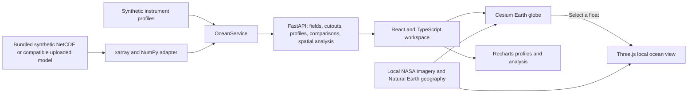

# OceanTwin3D — SIH presentation guide and four-member script

Prepared for the 10 September 2026 presentation. Project reference: SIH26067. Team: Runtime Rebels (confirm the team name and member names against your submitted PPT).

**One-line pitch:** OceanTwin connects a recognizable Earth globe, a local ocean water column, time-dependent model fields, and instrument-profile comparison in one interactive workspace.

**Presentation target:** 6 minutes 30 seconds, four speakers, one laptop operator. A five-minute cut and seven-minute extension are included below.

**Evidence baseline:** prototype commit `4f2b99a`, merged into the repository's default branch, `codex/oceantwin-prototype`. The model and all instrument profiles bundled with this version are synthetic. Describe it as a working visualization and integration prototype, not an operational forecasting system.

## 1. Project overview

### Problem and intended users

Ocean exploration involves several linked questions: where a phenomenon occurs, how it changes with depth, how it evolves over time, and how model values compare with observations. Separate maps, files, and profile charts make that investigation harder to follow.

OceanTwin's proposed users are ocean researchers, model analysts, students, and scientific teams evaluating ocean datasets. Its present contribution is an integrated exploration workflow. Operational decision support is a future application requiring real data, domain validation, and deployment work.

### What “4D ocean exploration” means

The spatial dimensions are longitude, latitude, and depth. Time is the fourth dimension. A user can select a location, descend through model levels, and compare different timestamps. The realistic Earth image supplies geographic context; the colored ocean fields come from a separate model dataset.

### The final prototype experience

1. Start on an Earth globe with locally bundled NASA Blue Marble imagery.
2. Rotate or zoom, or select a basin camera preset.
3. Choose **Ocean overlay** to display the selected scientific field on the globe.
4. Click an Argo marker, or select a float from the expandable **Observations** list.
5. Enter a broad local ocean cutout with a profile/comparison panel.
6. Switch between **Top-down** and **3D ocean**. Explore the depth slice, boundary sections, currents, variables, and timeline.
7. Use a profile probe, transect, or regional statistics for numerical investigation.
8. Select **Back to Earth** to restore geographic context.

The Indian Ocean cutout covers 40–105°E and approximately 28.28°S–28.28°N on the bundled grid, including the Arabian Sea, Bay of Bengal, and waters south of India. The requested geographic window is ±30° latitude; the displayed endpoints are the native grid coordinates inside it. Other floats open surrounding regional windows, with longitude unwrapping around the Pacific date line.

## 2. Complete feature inventory

| Area | Implemented capability | What it demonstrates |
| --- | --- | --- |
| Earth view | Cesium globe, NASA Blue Marble local image, atmospheric context, orbit/zoom and basin presets | Recognizable global geographic context |
| Geographic/data separation | Earth imagery and ocean-overlay controls | A natural basemap remains available independently of scientific coloring |
| Globe-to-ocean transition | Float selection opens a regional Three.js ocean view | Global location leads directly into local depth analysis |
| Local coverage | Broad regional model cutout with clipped Natural Earth coastlines | More context than a small patch immediately around a float |
| Local camera | Top-down and angled 3D views; camera fitted to viewport and domain | Whole-region inspection alongside the profile panel |
| Water column | Selected-depth slice, two depth-colored boundary sections, schematic volume points | Surface and subsurface structure within one view |
| Variables | Temperature, salinity, chlorophyll, derived current speed | Physical and biological model fields, with variable-specific units and palettes |
| Depth | Continuous interpolation between available model levels; depth presets | Exploration beyond the discrete source levels |
| Time | Playback, scrubbing and timestamped frames | Changes through time, with the previous frame retained during loading |
| Currents | Streamlines/particles following model u/v, density controls | Direction and relative spatial structure of model flow |
| Instruments | 17 synthetic Argo floats and 5 synthetic gliders, marker/list selection | A distributed instrument-profile workflow |
| Profiles | Depth charts and model/observation comparison | How a field varies vertically at an instrument position |
| Comparison metrics | Calculated RMSE, MAE and bias; timestamps and temporal offset | Quantitative comparison with visible time context |
| Profile probe | Click or enter coordinates; profile chart and all-variable table | Inspect a location without requiring an instrument there |
| Transect | Two coordinates, shortest great-circle route, fixed-depth values against distance | Analyze change along a geographic path |
| Region statistics | Rectangular selection; finite-cell mean, minimum, maximum, median, population standard deviation | Summarize the available model cells in a region |
| Data ingestion | NetCDF loading, coordinate/variable alias handling and supported unit normalization | A path from compatible scientific files to the interactive viewer |
| Upload handling | File/decoded-size bounds, validation, preservation of active data on failure, restore-demo control | Controlled dataset replacement |
| Data integrity | Missing-data preservation, periodic global interpolation, bounded visualization responses | Explicit handling of scientific and rendering constraints |
| Presentation | Presentation mode, optional intro, guided tour, keyboard controls | A focused demonstration flow |
| Local execution | PyCharm entry point; one Python process serves API and built frontend | Default demo can run locally after dependency installation |
| Developer interface | FastAPI documentation and optional read-only WebMCP `read_ocean_view` | Inspectable APIs and browser-supported view context |

### Exact bundled demonstration data

| Property | Current value |
| --- | --- |
| Longitude | 144 coordinates, −180° to 177.5°, 2.5° spacing |
| Latitude | 62 coordinates, −75° to 75° |
| Depth levels | 0, 10, 25, 50, 100, 200, 500, 1000, 2000 metres |
| Model dates | 13 weekly frames, 1 January–26 March 2026 |
| Instrument profiles | 22 total: 17 Argo and 5 gliders |
| Profile date | 12 February 2026 |
| Matching model date | On-screen frame 7, internal time index 6 |
| Source character | Deterministically generated synthetic model and perturbed synthetic profiles |

Smooth rendering and interpolation do not create additional measured resolution. Coastlines can look finer than the coarse model's wet/dry mask. The NASA basemap is a January 2004 geographic composite, not live imagery or a depiction of the selected 2026 model timestamp.

## 3. Technical architecture for the PPT

Use this diagram as the basis of the technical approach slide. It describes the implemented path, not future connectors.

| Layer | Technology and responsibility |
| --- | --- |
| Backend | Python and FastAPI; route validation, model access, numerical analysis and built-client serving |
| Scientific data | xarray, NumPy and NetCDF tooling; coordinate-aware model arrays, normalization and interpolation |
| Geography | Natural Earth land geometry; Shapely clipping for regional coastlines |
| Web client | React 19, TypeScript and Vite; interactive controls and coordinated view state |
| Global graphics | Cesium 1.128.0; Earth rendering, geographic picking and model overlays |
| Regional graphics | Three.js, React Three Fiber and Drei; local water column, slices, sections and particles |
| Charts | Recharts; profiles and analysis outputs |
| Execution | PyCharm project, `.venv` interpreter, `run.py`, local browser |

**Backend flow to explain:** validate coordinates and variable → retrieve the selected model time/depth → interpolate or crop as needed → return bounded, JSON-safe arrays → render and inspect in the client.

**Useful API examples for the technical slide or appendix:**

- `GET /api/ocean/slice` — field at a selected depth and time.
- `GET /api/ocean/volume` — bounded depth-resolved field.
- `GET /api/ocean/region` — local field, currents, coastlines and instruments around a selected location.
- `GET /api/currents` — u/v current field.
- `GET /api/ocean/profile` — vertical profile at coordinates.
- `GET /api/ocean/transect` — fixed-depth great-circle samples.
- `GET /api/ocean/stats` — finite-cell regional statistics.
- `GET /api/compare/{instrument_id}` — comparison profile and calculated metrics.
- `POST /api/datasets/upload` — validated NetCDF upload.

### Scientific calculations in plain language

At a comparison location, the model is sampled at the instrument's coordinates and depth. For each finite matched pair, define error as **model − observation**:

- **MAE:** average absolute error; the typical error magnitude.
- **RMSE:** square root of average squared error; larger errors contribute more strongly.
- **Bias:** average signed error; positive means the model is higher on average.

The metrics are calculated from the selected data, not static example numbers. In the bundled demo, however, both sides are synthetic; these results demonstrate calculation and comparison, not independent forecast accuracy.

## 4. Slide-ready PPT content

Use your required SIH template if one has been supplied. The structure below is a content plan, not a claim about an official required slide count. Keep the main deck to roughly eight slides; move API details and formulas to backup slides.

### Slide 1 — OceanTwin: from Earth to ocean depth

**Copy onto the slide:**

- Interactive 4D ocean exploration and model–observation comparison.
- One workspace for location, depth, time and profiles.
- SIH26067 · Runtime Rebels · four member names.

**Visual:** a real screenshot of the current Earth view beside the local ocean view. Label it “Working prototype · synthetic demo data.”

### Slide 2 — The problem and our approach

**Copy onto the slide:**

- Ocean analysis combines geographic fields, depth profiles and time-dependent datasets.
- Separate views make it harder to connect a location with its subsurface structure and comparisons.
- OceanTwin connects global exploration, regional detail and numerical analysis.

**Visual:** “Locate → Descend → Compare → Analyze.” Present the first two bullets as your design motivation; do not add unsupported time-saving percentages.

### Slide 3 — Technical approach

**Copy onto the slide:**

- Python + FastAPI for scientific data access and calculations.
- xarray/NumPy adapter for compatible NetCDF model grids.
- React/TypeScript with Cesium globe, Three.js ocean view and Recharts profiles.
- One local Python process serves the built application and API.

**Visual:** the architecture diagram above. Add a small separate “Future: validated operational data connectors” box if space permits.

### Slide 4 — The key interaction: globe to ocean

**Copy onto the slide:**

- Select an Argo float on Earth.
- Open a broad local ocean region with coastline and profile context.
- Switch between Top-down and 3D ocean.
- Explore depth-colored sections and return to Earth without changing tools.

**Visual:** three current screenshots with arrows: globe → local water column → profile. This is the strongest feature to demonstrate live.

### Slide 5 — Explore the fourth dimension

**Copy onto the slide:**

- Temperature, salinity, chlorophyll and current speed.
- Nine source depth levels, extending to 2,000 m, with interpolation.
- Thirteen weekly model frames with playback and scrubbing.
- Current particles follow model u/v; depth scale is schematic.

**Visual:** the same variable at surface and 1,000 m, with readable units and timestamps. Use matching color limits so the comparison is meaningful.

### Slide 6 — From visualization to scientific inspection

**Copy onto the slide:**

- 22 synthetic instrument profiles: 17 Argo and 5 gliders.
- Calculated RMSE, MAE and bias with model/profile timestamps.
- Coordinate-based profile probe, fixed-depth transect and regional statistics.
- Missing values remain missing; global sampling handles the date line.

**Visual:** one legible profile comparison and one analysis chart. Avoid crowding the slide with all panels.

### Slide 7 — Feasibility, validation and intended value

**Copy onto the slide:**

- Working local PyCharm prototype; default demo runs offline after setup.
- 28 backend tests + 3 frontend numerical tests passed; production builds passed.
- Intended value: connect geographic and vertical context for exploration and teaching.
- Modular model adapter and APIs provide a starting point for real-data integration.

**Speaker note:** these checks establish tested behaviors, not production readiness, universal device performance, or scientific forecast skill. The final wider view and NASA basemap still need a projector/laptop visual rehearsal.

### Slide 8 — Next steps and closing

**Copy onto the slide:**

- Integrate permitted, validated operational ocean models and observation feeds.
- Add observation QC and stronger temporal matching workflows.
- Support additional grids, bathymetry and full vertical transects.
- Evaluate performance and usability with domain experts.

**Closing line:** “Our prototype connects Earth-scale context with ocean-depth investigation in one continuous workflow.”

### Special highlights worth emphasizing

1. **The globe is an entry point for investigation:** selecting a float changes the scale of exploration and brings its profile into context.
2. **The flat view retains broad ocean coverage:** the Indian Ocean cutout includes both northern basins and waters south of India.
3. **Geography and model data are distinct:** a recognizable NASA basemap is separate from scientific overlays.
4. **Time context is visible in comparisons:** show matching timestamps, not just attractive curves.
5. **Scientific edge cases are handled:** missing cells and the Pacific date line have numerical checks.
6. **The main demo is locally runnable:** bundled imagery and engine assets reduce dependence on presentation-room connectivity after installation.
7. **Numerical tools accompany the visuals:** a probe, transect and regional statistics turn exploration into inspectable results.

Call these project strengths. Do not describe them as globally unique inventions or claim superiority over named scientific products without comparative evidence.

## 5. Four-member presentation script — approximately 6:30

Replace “Member 1” through “Member 4” with names. Assign Member 3 as the laptop operator for the whole presentation; other speakers should not fight over the mouse. The quoted paragraphs are the spoken script. The action cues are not spoken. Timings include brief clicks and transitions; rehearse once with a stopwatch and adjust your pace.

| Speaker | Time | Responsibility | Screen |
| --- | --- | --- | --- |
| Member 1 | 0:00–1:20 | Problem, purpose and scope | Slides 1–2 |
| Member 2 | 1:20–2:45 | Architecture and engineering strengths | Slide 3, then slide 4 |
| Member 3 | 2:45–4:40 | Core live globe-to-ocean demonstration | Browser; slides 4–5 as backup |
| Member 4 | 4:40–6:30 | Comparison, evidence, roadmap and close | Browser, then slides 7–8 |

### Member 1 — problem and purpose, 0:00–1:20

**Action:** show the title slide, then the problem slide. Keep the browser loaded in advance.

> Good morning. We are Runtime Rebels, and our project is OceanTwin: an interactive workspace for exploring the ocean across location, depth and time.
>
> When studying an ocean dataset, a map answers only part of the question. We also need to understand what lies below the surface, how conditions change over time, and how a model compares with instrument profiles. Moving between disconnected views makes that investigation harder to follow.
>
> Our approach connects these steps. A user starts with Earth, selects an ocean location or an Argo float, enters a regional water-column view, and inspects the corresponding profiles and numerical results.
>
> This prototype is intended to support exploration, learning and model inspection. Today we are demonstrating synthetic model data and synthetic instrument profiles, with a compatible NetCDF loading path for extending the workflow. We are demonstrating the interaction and calculations, not claiming a live operational forecast.
>
> My teammate will explain how we built it.

### Member 2 — architecture and implementation, 1:20–2:45

**Action:** point along the architecture diagram from left to right. Move to the globe-to-ocean slide at the handoff.

> OceanTwin has a Python scientific backend and an interactive web frontend. The backend uses FastAPI, with xarray and NumPy to access model grids, normalize supported inputs and calculate results.
>
> The frontend uses React and TypeScript. Cesium provides the global Earth view, while Three.js provides the local ocean water column. Recharts displays the profiles and analysis charts. A single local Python process serves both the API and the built application, so we can run the prototype directly from PyCharm.
>
> The important connection is between these views: selecting a float requests the surrounding model region, coastline, currents and instrument context. Depth and time controls then drive the displayed scientific data.
>
> We also handle practical details such as missing values, bounded visualization responses and longitude wrapping near the date line. The Earth imagery and rendering assets are bundled locally, so the normal demo does not need an external tile service after setup.
>
> Let us now show that workflow in the prototype.

### Member 3 — live prototype, 2:45–4:40

**Action A — approximately 25 seconds:** show Earth imagery. Rotate gently; keep the Indian Ocean visible. Avoid a long cinematic introduction.

> This is the Earth view. The basemap gives us recognizable geographic context. We can switch on an ocean overlay to display a model variable, but the scientific field and the Earth image remain separate layers.

**Action B — approximately 40 seconds:** select Indian Ocean float **ARGO-5900010** from the expanded Observations list if marker clicking is awkward. Click **Top-down**, then **3D ocean**.

> Selecting this Argo float opens the local ocean view and its profile. The region includes the Arabian Sea, Bay of Bengal and waters south of India, rather than only a tiny patch around the instrument. Top-down preserves the map layout; the angled view reveals the water column and depth-colored boundary sections.

**Action C — approximately 35 seconds:** keep Temperature selected. Move from 0 to 500 m, then 1,000 m. Pause for each update. Select current speed or enable currents if needed.

> We can now descend through the model. The depth slice changes with the selected level, and values between source levels are interpolated. Temperature, salinity, chlorophyll and current speed are available. Current particles follow the model's horizontal velocity components. The vertical scale and animation are schematic so the structure is readable.

**Action D — approximately 15 seconds:** play briefly, pause, and select frame 7, dated 12 February 2026, for the next speaker. Keep the float selected.

> The timeline adds the fourth dimension. We will now use the model date matching the synthetic profile and inspect the comparison.

### Member 4 — comparison, evidence and closing, 4:40–6:30

**Action A — approximately 40 seconds:** show the selected float's comparison panel. If comparison is disabled, enable **Compare with model**. Read no metric number unless it is visible and finite.

> Here we compare the model profile with the selected instrument profile. Depth increases downward, and the model and profile timestamps are visible. OceanTwin calculates RMSE, MAE and bias from the matched values. These describe error magnitude and signed difference; they are not decorative values in the interface.
>
> Because our current profiles are synthetic, these results demonstrate the comparison workflow, not independent model accuracy.

**Action B — approximately 25 seconds:** close the inspector, open **Analysis → Profile Probe**, use latitude 5 and longitude 65, and run the analysis. If time is short, show its prepared screenshot instead.

> A user can also inspect a coordinate directly, sample a fixed-depth transect between two points, or summarize a rectangular region. This connects the visualization to numerical investigation.

**Action C — approximately 45 seconds:** show validation and roadmap slides. Finish with the title or closing line.

> The current version passed twenty-eight backend tests, three frontend numerical tests and production builds. It is a locally runnable prototype, with real-data integration and domain evaluation still ahead.
>
> Our next steps are validated operational datasets, observation quality control and broader scientific grid support. OceanTwin's central contribution is a continuous path from Earth-scale context to ocean-depth investigation, with time and profile comparison in the same workspace. Thank you. We are ready for your questions.

### If the judges allow only five minutes

- Member 1: 0:00–1:00. Omit the paragraph beginning “This prototype is intended”; retain the sentence disclosing synthetic data.
- Member 2: 1:00–2:00. Shorten technology names to “Python/FastAPI backend and React with Cesium and Three.js.” Keep the locally runnable architecture and date-line/missing-data point.
- Member 3: 2:00–3:35. Show Earth → float → angled ocean → one depth change. Skip Top-down and playback, but set frame 7 before the demo begins.
- Member 4: 3:35–5:00. Show comparison; skip the live probe. Retain the test evidence, synthetic-data interpretation and closing roadmap.

### If you have seven minutes

Keep the 6:30 script and use the additional 30 seconds to show **Analysis → Transect**, latitude/longitude A=(5,65), B=(15,85), at surface depth. Explain the value-versus-distance chart. Do not add another feature if the first transition takes longer than rehearsed.

## 6. Demonstration setup and recovery sheet

### Before the presentation

- Open the repository root in PyCharm and select its `.venv/Scripts/python.exe` interpreter.
- Run `run.py`; use `http://127.0.0.1:8000/`. Keep only one server using port 8000.
- Confirm the latest code is present and the production frontend is built. Frontend edits require `npm run build` inside `frontend`; backend changes require restarting the server.
- Confirm **DEMO DATA**, the NASA Earth basemap, float selection, both local camera buttons and **Back to Earth** on the actual presentation display.
- Rehearse at the projector's resolution. The final expanded cutout/camera and NASA image have build/data verification; the last automated visual pass was interrupted by a browser-session problem.
- Prepare genuine screenshots of Earth, the local ocean view and a profile comparison. Keep them in the PPT as a fallback; do not use the architecture poster's illustrative renders as screenshots of implemented behavior.
- Set the profile comparison to frame 7 / 12 February 2026. Use the same variable on both profiles.
- Keep the laptop powered, close unnecessary graphics-heavy tabs, and choose low particle density if rendering is slow.
- Install dependencies before entering the room. Offline operation refers to the default installed demo, not a fresh setup or optional online imagery.

### Rehearsal coordinates

| Tool | Input | Interpretation |
| --- | --- | --- |
| Profile probe | Latitude 5, longitude 65 | Vertical values at a wet Indian Ocean location |
| Transect | A=(5,65), B=(15,85), depth 0 | Fixed-depth great-circle section; about 2,453 km |
| Regional statistics | Latitudes 5–15, longitudes 65–85, depth 0 | Statistics of finite cells within the rectangle |
| Optional date-line transect | A=(0,170), B=(0,−170) | Short crossing of about 2,224 km, not a nearly global route |

### If something takes longer than expected

- During a loading notice, explain the current view and wait; avoid repeatedly clicking controls.
- If float picking is awkward, use the Observations list.
- If the live browser fails, move to the prepared screenshot and say: “This is a captured view of the same prototype; I will explain the interaction here.”
- If a coastal query has no data, use the rehearsed wet coordinates. Do not interpret missing values as zero.
- Do not upload a new, unrehearsed NetCDF file during the timed demonstration.

## 7. Likely judge questions and concise answers

**Is this live Argo or INCOIS data?**  
No. The bundled fields and all profiles are synthetic. Compatible model NetCDF loading is implemented; an operational feed and validated observation ingestion remain future work.

**What makes this 4D?**  
Longitude, latitude and depth form the spatial dimensions; the timeline selects successive model states.

**Is the Earth texture the ocean dataset?**  
No. NASA Blue Marble provides static geographic context. Scientific overlays are separate model arrays with their own dates, units and values.

**Is the comparison meaningful if the data are synthetic?**  
It demonstrates sampling, matched-profile display and metric calculation. It does not establish independent predictive skill because the synthetic observations are derived from the model plus perturbations.

**Is this an AI model?**  
The implemented analysis is numerical interpolation, statistics and visualization. There is no trained prediction model in the delivered prototype. The optional read-only browser tool exposes view context; it is not an AI forecast system.

**Does the 3D view show actual bathymetry?**  
No. It shows a schematically exaggerated model water column. The displayed bottom is a reference at the model's maximum depth, not a measured seafloor. The isosurface option is a threshold-band preview, not a reconstructed continuous surface.

**How do you handle missing data?**  
Missing model cells remain missing, and interpolation avoids inventing values across missing coastal samples. Profile metrics use finite matched pairs.

**Can this work offline?**  
The default installed synthetic demo uses local assets and can run without external data services. Initial dependency installation and optional online layers require connectivity.

**How is it validated?**  
The recorded release passed 28 backend tests and 3 frontend numerical tests, including interpolation, comparison calculations, date-line handling and regional cutout consistency. Builds passed in both project copies. This is software verification, not operational scientific certification.

**Can it support every ocean model format?**  
No. It currently supports compatible rectilinear grids and selected coordinate/variable/unit conventions. Curvilinear grids, pressure or sigma depth coordinates, nonstandard calendars and some regional date-line cases require preprocessing or further implementation.

**How does this help users?**  
It is designed to reduce the switching between geographic, depth, time and comparison views. Usability gains and time savings still need to be measured with real users.

**What is the next milestone?**  
Connect one permitted real model product and a validated observation dataset, verify spatial/temporal matching against a trusted reference, and evaluate the workflow with domain users before broadening the scope.

## 8. Current work versus future additions

| Working in the prototype | Add later; label as planned in the PPT |
| --- | --- |
| Synthetic model and profile demonstration | Live/operational ocean model and observation connectors |
| Compatible NetCDF upload and validation | Broader formats, curvilinear and terrain-following grids |
| Interpolation, profile metrics and spatial statistics | Observation QC pipeline, uncertainty analysis and richer temporal collocation |
| Schematic depth rendering and threshold-band preview | Measured bathymetry, full volume rendering and reconstructed isosurfaces |
| Fixed-depth transect chart | Full vertical transect sections |
| Local single-process demo | Authenticated multi-user deployment, permissions and operational monitoring |
| Numerical analysis | Any proposed trained AI anomaly detection or prediction module |

## 9. Final wording checks for the PPT

- Use **“synthetic demonstration”**, not “live ocean monitoring.”
- Use **“calculated comparison metrics”**, not an unsupported accuracy percentage.
- Use **“schematic water column”**, not “accurate seafloor digital twin.”
- Use **“current particles follow model u/v”**, not “validated drift forecast.”
- Use **“finite grid-cell regional mean”**, not “area-weighted ocean average.”
- Use **“fixed-depth transect”**, not “full vertical cross-section” for the transect tool.
- Keep future AI, connectors and QC in the roadmap. Do not mark them implemented because they appear in a concept poster.
- Explain local upload validation without calling the prototype production-secure or claiming authentication it does not have.

## 10. Project references

- [OceanTwin3D repository](https://github.com/manaour2006/OceanTwin3D)
- [Implementation overview](../README.md)
- [Detailed demo controls and recovery](DEMO.md)
- [Validation record and limits](VALIDATION.md)
- [NASA basemap attribution](../frontend/public/earth-imagery.md)
- [Local prototype](http://127.0.0.1:8000/)
- [Local API documentation](http://127.0.0.1:8000/docs)

**Team rehearsal rule:** all four members should be able to state the one-line pitch, explain what the data represent, and perform the Earth → float → ocean → profile transition.
